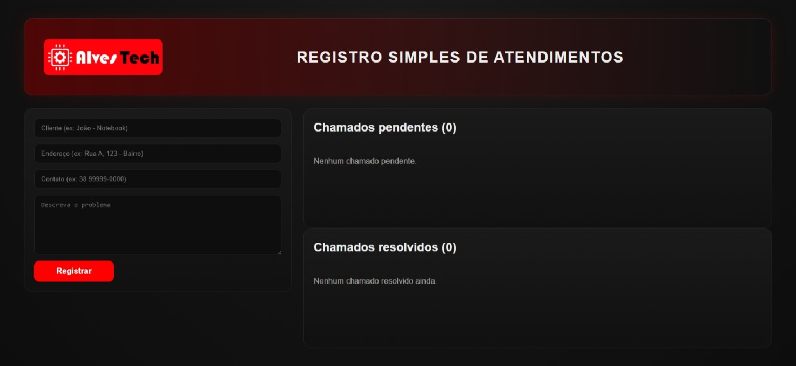

# Sistema de Chamados - Alves Tech
## 📸 Preview do sistema



Sistema simples de abertura e gerenciamento de chamados, desenvolvido em React para simular rotinas de atendimento e suporte técnico.

## 📌 Sobre o projeto

Este projeto foi criado com o objetivo de representar um fluxo básico de atendimento, permitindo registrar, acompanhar e gerenciar chamados de forma organizada.

A aplicação simula situações reais da área de suporte, como abertura de chamados, acompanhamento de status e resolução de atendimentos.

## 🚀 Tecnologias utilizadas

- React
- JavaScript
- Vite
- HTML
- CSS

## ⚙️ Funcionalidades

- Cadastro de novos chamados
- Listagem de chamados pendentes
- Marcar chamado como concluído
- Reabrir chamados finalizados
- Exclusão de chamados
- Exibição de data e hora do atendimento
- Interface organizada e intuitiva

## 🧠 Aprendizados

Com este projeto, pratiquei:

- Manipulação de estado no React
- Estruturação de componentes
- Lógica de fluxo de aplicação
- Organização de interface para sistemas reais
- Simulação de rotinas de suporte técnico

## ▶️ Como executar o projeto

```bash
# Clonar o repositório
git clone https://github.com/regesalves/sistema-de-chamados-react.git

# Acessar a pasta
cd sistema-de-chamados-react

# Instalar dependências
npm install

# Rodar o projeto
npm run dev