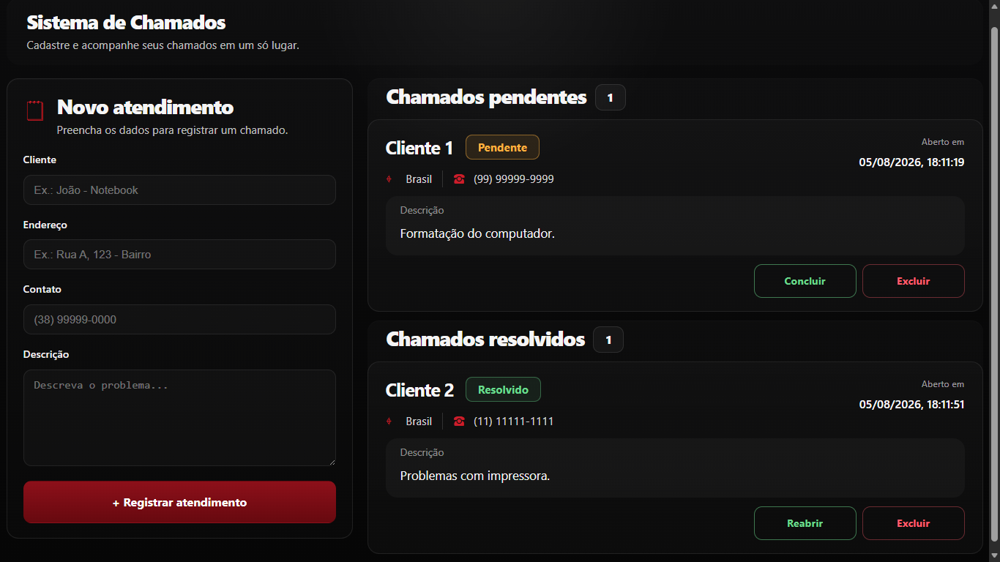

# 🎫 Sistema de Chamados

Sistema web para registro e acompanhamento de solicitações de suporte, desenvolvido como projeto acadêmico com React e JavaScript.

<p align="center">
  
</p>

---

## 📌 Sobre o projeto

O Sistema de Chamados foi desenvolvido como trabalho final do curso **Programação Frontend com React e JavaScript**, realizado pelo Instituto Federal de Santa Catarina (IFSC), com carga horária de 60 horas.

O projeto simula um fluxo básico de atendimento e permite registrar, acompanhar e organizar chamados técnicos.

A proposta foi colocar em prática conhecimentos de desenvolvimento web a partir de uma situação relacionada ao atendimento e suporte técnico.

---

## 🔄 Fluxo de atendimento

O sistema permite acompanhar diferentes etapas de uma solicitação:

**Cadastro → Atendimento → Conclusão → Reabertura**

Entre as principais funcionalidades estão:

- Cadastro de novos chamados
- Listagem e acompanhamento de chamados
- Conclusão de atendimentos
- Reabertura de chamados finalizados
- Exclusão de chamados
- Registro de data e hora
- Persistência dos dados com `localStorage`

---

## 🧠 O que o projeto demonstra

Além da aplicação dos conhecimentos técnicos do curso, o projeto permite observar:

- organização de um fluxo de atendimento;
- estruturação de informações;
- gerenciamento de estados da aplicação;
- organização de funcionalidades;
- relação entre solicitação, atendimento e conclusão;
- persistência de informações no navegador.

O projeto também representa a aplicação prática da experiência em Suporte Técnico na organização de um fluxo básico de atendimento.

---

## 🛠️ Tecnologias utilizadas

<p align="center">
  
  
  
  
  
  
</p>

---

## ▶️ Como executar

É necessário ter o **Node.js** e o **Git** instalados.

Clone o repositório:

```bash
git clone https://github.com/regesalves/sistema-de-chamados-react.git
